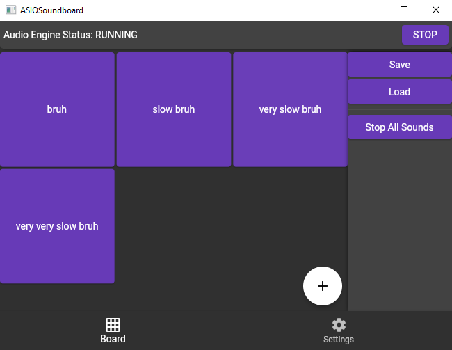
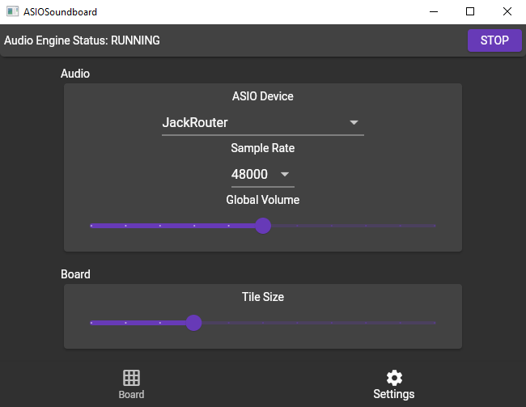

# ASIO Soundboard

This is a simple soundboard app built using C# and Flutter. Lets you play audio clips into any ASIO device using hotkeys. Recommended to use together with [AutoHotkey](https://www.autohotkey.com/) and [JackRouter](https://jackaudio.org/faq/jack_on_windows.html).

Board | Settings
-|-
 | 

## Features

- Save/load soundboard from a file
- Trigger sounds using http requests or from an AHK script
- Resample audio files to match your audio card settings
- Change volume for the whole app or each individual sound
- Adjust UI to your preference
- *More features coming in the future...*

## Installation and Usage

- Download the [latest release](../../releases/latest)
- Unzip the archive
- Launch the app

When the app is running, go to Settings and select an Audio Device you want to use for playback. Then select the Sample Rate your device is working at (to set or see your device's sample rate, find and open its control panel). After that hit the Start button at the top-right of the app window. If everything is done correctly, the text in top-left will say that the Audio Engine is working. You can hit the button again to stop it at any time. Now you can actually play the sounds by navigating to Board and hitting the + button in bottom-right. Use the dialog to add a sound, when done click the tile that just appeared and you will hear the sound you selected. You can also right-click the tile to open its menu.
    
## Building

- Clone the repository
- Make sure `main` or `beta` branch is selected
- Make sure you have the latest Flutter SDK and .NET 6 installed
- Open the terminal in 'flutter-ui' directory (located inside C# project folder)
- Run `flutter pub get`
- Run `flutter build web`. Note: this might fail if you placed the project on a network drive. If it fails, move the project to a local drive, or create a symlink pointing to it
- Open C# solution
- Set Configuration to 'Release'
- Click 'Build' at the top and select 'Build Solution' (or hit F6)

You will find compiled project somewhere in the bin directory.

## Development

### Repository Structure

Root folder of this repository is a .NET solution. It has a directory called 'ASIOSoundboard' which contains a C# project (soundboard's backend) and a folder called 'flutter-ui' with soundboard's frontend. There are some other folders that are present in the root directory:
- 'hooks' currenty has a template pre-commit hook that I might use in the future (written in Java because why not) (you will need to install Java 11 to use it) (actually it doesn't even work when using Github Desktop) (apparently hooks are not even supported on Windows?) (well, they are, but also thery aren't) (I hate my life) (ignore this for now).
- 'ahk' contains some AutoHotkey scripts that are automatically copied to the output directory when the app is built. These scripts can be used after installing the soundboard to do some cool stuff like triggering specific sounds or managing the soundboard on key presses (in other words, I was too lazy to implement in-app hotkeys, so I went with an AutoHotkey integration instead).
- 'img' contains images used in this repo (for example app screenshots).

### Debugging

You may notice that C# project has several launch profiles. 'main' profile starts debugging normally. 'no-ui' also starts debugging normally, but disables app's UI. When launching this way you can debug the Flutter app separately from the main application (it will still connect to it and work fine, because all the communication is done via WebSockets). To debug the Flutter app, simply open Flutter project in VS Code and hit F5 (I personally selected a Windows build to debug the app, but web version should also work fine). Note that the Host (C# app) must by already running, otherwise the communication will fail. Also, in the current implementation, when you close the Flutter app the Host continues running, and launching the Flutter app again may lead to unexpected results, so make sure to also restart the host when restarting the UI.

## Guides

I will update this section with links to this repo's wiki, where I will describe how to set up AHK, JackRouter and maybe some other stuff.

## Credits

Following libraries and packages are used in this project:
- WPF (.NET 6) and Flutter
- [NAudio](https://github.com/naudio/NAudio) - Audio playback and processing
- [EmbedIO](https://unosquare.github.io/embedio/) - Serving the UI; WebSocket and HTTP communication
- [flutter_bloc](https://bloclibrary.dev) - Flutter state management
- [web_socket_channel](https://github.com/dart-lang/web_socket_channel) - Flutter WebSocket client
